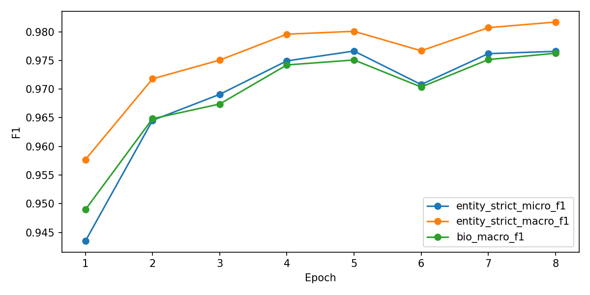
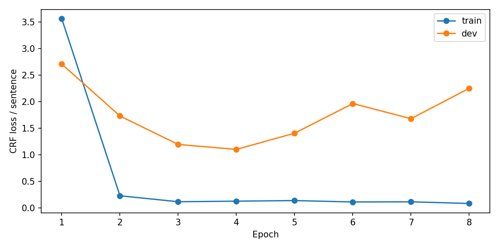

# PAP-NER — XLM-RoBERTa + CRF

Nhận dạng thực thể trong văn bản tiếng Việt với **XLM-RoBERTa base + Conditional Random Field (CRF)** trên bộ dữ liệu PAP_NER. Repository lưu notebook đã chạy, đồ thị huấn luyện và các báo cáo đánh giá; checkpoint dung lượng lớn được cung cấp qua Google Drive.

**Kết quả chính:** Test Strict Micro F1 **97,6871%**, Strict Macro F1 **97,7072%**. Checkpoint tốt nhất được chọn ở **epoch 5** theo Dev Strict Micro F1; training dừng sớm sau **8 epoch**.

> Tên thư mục output và một số phần Markdown trong notebook còn ghi `phobert` hoặc `5epoch`. Cấu hình và code của lần chạy thực tế sử dụng `FacebookAI/xlm-roberta-base`, đặt tối đa 20 epoch và early stopping patience 3. Các kết quả dưới đây được lấy từ output đã lưu, không phải kết quả của PhoBERT.

## Notebook và dữ liệu

- [Mở notebook đã chạy](<PAP_NER_XLMR_CRF_5epoch_Linux_3090_5060_evalplus_v2%20%281%29.ipynb>).
- Dataset trong cấu hình: `Leekien0108/PAP_NER` trên Hugging Face.
- Dataset revision: `7a0f6b1233667702925baa69c07c55d5d26eb6cd`.
- Các loại thực thể: `CQ`, `ĐT`, `VBPL`, `NG`, `SL`; nhãn theo định dạng BIO, tổng cộng 11 nhãn tính cả `O`.
- Notebook đọc nhãn NER ở **cột thứ 4** của file CoNLL và dùng subword đầu tiên của mỗi từ cho CRF.

Số câu được ghi trong output notebook:

| Split | Số câu |
|---|---:|
| Train | 142.218 |
| Dev | 10.305 |
| Test | 10.278 |

Các thống kê đã lưu ghi nhận **0 câu bị cắt ngắn, 0 từ bị loại** ở cả train, dev và test.

## Cấu hình huấn luyện

| Tham số | Giá trị của lần chạy |
|---|---|
| Encoder | `FacebookAI/xlm-roberta-base` |
| Head | Linear + CRF |
| GPU | NVIDIA GeForce RTX 3090 24 GB |
| PyTorch / CUDA wheel | `2.5.1+cu121` / CUDA 12.1 |
| Transformers | `4.44.2` |
| Precision | FP16 cho encoder/linear; FP32 cho CRF |
| Max sequence length | 256 |
| Train / eval batch size | 32 / 32 |
| Gradient accumulation | 1; batch hiệu dụng 32 |
| Gradient checkpointing | Tắt |
| Encoder learning rate | `2e-5` |
| Linear/CRF learning rate | `1e-3` |
| Optimizer | AdamW |
| Scheduler | Linear warmup/decay; warmup 10% |
| Weight decay / dropout | `0.01` / `0.1` |
| Gradient clipping | `1.0` |
| Seed | 42 |
| Epoch tối đa / early stopping patience | 20 / 3 |
| Chọn best checkpoint | Dev Strict Micro F1 |

Cấu hình đầy đủ: [run_config.json](papner_phobert_crf_official_20ep_seed42_rtx3090_24gb/run_config.json). Môi trường của lần chạy: [requirements-frozen.txt](papner_phobert_crf_official_20ep_seed42_rtx3090_24gb/requirements-frozen.txt).

## Kết quả sau huấn luyện

### Đồ thị F1 trên dev



### Đồ thị loss trên train và dev



### Lịch sử huấn luyện

Các điểm F1 bên dưới là kết quả trên **dev**, đơn vị **%**; loss là CRF loss trung bình mỗi câu.

| Epoch | Train loss | Dev loss | Strict Micro F1 | Strict Macro F1 | BIO Macro F1 |
|---:|---:|---:|---:|---:|---:|
| 1 | 3,5673 | 2,7118 | 94,3474 | 95,7693 | 94,8960 |
| 2 | 0,2307 | 1,7330 | 96,4540 | 97,1787 | 96,4826 |
| 3 | 0,1187 | 1,1974 | 96,9073 | 97,5051 | 96,7389 |
| 4 | 0,1292 | 1,1035 | 97,4914 | 97,9572 | 97,4205 |
| **5 (best)** | **0,1406** | **1,4090** | **97,6630** | **98,0080** | **97,5075** |
| 6 | 0,1139 | 1,9670 | 97,0787 | 97,6682 | 97,0357 |
| 7 | 0,1170 | 1,6826 | 97,6171 | 98,0710 | 97,5137 |
| 8 | 0,0856 | 2,2547 | 97,6578 | 98,1697 | 97,6250 |

Mỗi epoch mất khoảng 15,7–15,9 phút, peak VRAM được ghi nhận khoảng **8,34 GiB**. Dữ liệu gốc: [history.json](papner_phobert_crf_official_20ep_seed42_rtx3090_24gb/history.json).

Trích output kết thúc training:

```text
Early stopping reached.
Training finished. Best dev entity_strict_micro_f1=0.976630

Train hoàn tất.
Best model: /workspace/ner-pap/runs/papner_phobert_crf_official_20ep_seed42_rtx3090_24gb/best_model.pt
```

### Đánh giá test với best checkpoint

Các chỉ số bên dưới lấy từ [test_metrics.json](papner_phobert_crf_official_20ep_seed42_rtx3090_24gb/test_metrics.json); Precision, Recall, F1 và Accuracy được hiển thị theo **%**.

| Chỉ số | Giá trị |
|---|---:|
| Entity Strict Micro Precision | 98,3336 |
| Entity Strict Micro Recall | 97,0491 |
| **Entity Strict Micro F1** | **97,6871** |
| Entity Strict Macro F1 | 97,7072 |
| BIO Token Accuracy | 99,2693 |
| BIO Token Macro F1 | 97,5940 |
| CRF loss mỗi câu | 1,2668 |

Output strict entity report từ `seqeval` (các điểm số ở thang **0–1**):

```text
              precision    recall  f1-score   support

          CQ     0.9845    0.9614    0.9728      7311
          NG     0.9998    1.0000    0.9999      4021
          SL     0.9716    0.9609    0.9662      1638
        VBPL     0.9747    0.9771    0.9759       828
          ĐT     0.9766    0.9646    0.9706      7179

   micro avg     0.9833    0.9705    0.9769     20977
   macro avg     0.9814    0.9728    0.9771     20977
weighted avg     0.9833    0.9705    0.9768     20977
```

Báo cáo đầy đủ gồm cả BIO token report: [test_report.txt](papner_phobert_crf_official_20ep_seed42_rtx3090_24gb/test_report.txt).

### Đánh giá nâng cao với nervaluate

Notebook còn lưu đánh giá Strict / Partial / Entity Type / Exact. Bảng tóm tắt F1 dưới đây có đơn vị **%**:

| Tag | Strict F1 | Partial F1 | Entity Type F1 | Exact F1 |
|---|---:|---:|---:|---:|
| CQ | 97,23 | 97,71 | 98,07 | 97,23 |
| ĐT | 97,03 | 97,95 | 98,85 | 97,03 |
| VBPL | 97,59 | 98,49 | 99,40 | 97,59 |
| NG | 99,99 | 99,99 | 99,99 | 99,99 |
| SL | 96,09 | 97,62 | 99,15 | 96,09 |
| Micro | 97,62 | 98,25 | 98,84 | 97,62 |
| Macro | 97,59 | 98,35 | 99,09 | 97,59 |

Xem [bảng đầy đủ Precision / Recall / F1](papner_phobert_crf_official_20ep_seed42_rtx3090_24gb/advanced_eval_table.md) và [summary JSON](papner_phobert_crf_official_20ep_seed42_rtx3090_24gb/advanced_eval_summary.json).

**Lưu ý khi so sánh:** Strict Micro F1 của `nervaluate` là **97,6174%**, còn chỉ số chính từ `seqeval` strict IOB2 là **97,6871%**. Hai báo cáo đã lưu có số lượng entity gold khác nhau (20.979 và 20.977); cần giữ riêng kết quả của từng evaluator khi báo cáo.

## Ví dụ inference từ notebook

Đầu vào đã được word-segment:

```text
Uỷ_ban_nhân_dân tỉnh Thái_Bình ban_hành Nghị_định 123/2020/NĐ-CP ngày 15 tháng 10 năm 2020 về đăng_ký doanh_nghiệp với lệ_phí 5 triệu đồng .
```

Output nhãn BIO:

```text
Uỷ_ban_nhân_dân   B-CQ
tỉnh              I-CQ
Thái_Bình         I-CQ
ban_hành          O
Nghị_định         B-VBPL
123/2020/NĐ-CP    I-VBPL
ngày              O
15                O
tháng             O
10                O
năm               O
2020              O
về                O
đăng_ký           O
doanh_nghiệp      B-ĐT
với               O
lệ_phí            O
5                 B-SL
triệu             I-SL
đồng              I-SL
.                 O
```

Đây là output minh họa của một câu thử. Với văn bản thô, cần word segmentation trước khi dự đoán, như hướng dẫn trong notebook.

## Tải checkpoint (.pt)

**[Tải checkpoint và các file mô hình trên Google Drive](https://drive.google.com/drive/folders/1-6WWQUBhfH9hAXEQsv1EDA39X0zmi6Ll?usp=sharing)**

Các checkpoint có trong kết quả local:

| File | Mục đích | Dung lượng local xấp xỉ |
|---|---|---:|
| `best_model.pt` | Đánh giá test và inference với checkpoint tốt nhất | 1,03 GiB |
| `last_checkpoint.pt` | Tiếp tục training từ checkpoint cuối | 3,10 GiB |

Link Drive do chủ repository cung cấp; nội dung và quyền truy cập của thư mục chưa được xác minh. Hãy tải checkpoint cần dùng rồi đặt vào `RUN_DIR` của notebook. File `.pt` và ZIP kết quả được loại khỏi Git bằng `.gitignore`.

## Chạy lại notebook

1. Chuẩn bị Linux hoặc môi trường Linux có GPU NVIDIA, driver hoạt động với `nvidia-smi`, Python 3.10–3.12 có `venv`/`ensurepip`, kết nối mạng và ít nhất 12 GiB dung lượng trống theo kiểm tra của notebook.
2. Mở notebook, kiểm tra cell **GPU và cấu hình**: `GPU_PROFILE`, `TRIAL_EPOCHS`, `RESUME`, dataset revision và đường dẫn làm việc. Đường dẫn trong JSON đã lưu thuộc máy training cũ; khi chuyển máy, dùng cấu hình được notebook tạo lại.
3. Để train lại từ đầu, chạy lần lượt các cell cấu hình, tạo môi trường, tải dataset, tạo runner, smoke test và train. Notebook tự cài các dependency của từng profile.
4. Chạy các cell lịch sử train, test, đánh giá nâng cao và inference để tạo output tương ứng.

Notebook có hai profile: RTX 3090 dùng batch 32, accumulation 1; RTX 5060 dùng batch 4, accumulation 8 và gradient checkpointing. Cả hai giữ batch hiệu dụng 32; kết quả trong README là của **RTX 3090**.

**Dùng checkpoint có sẵn:** chạy các cell cấu hình, môi trường, dataset và tạo runner trước; sau đó chép `best_model.pt` vào `RUN_DIR`, bỏ qua các cell smoke test/train và chạy test hoặc inference. Để resume, đặt `RESUME = True`, chép `last_checkpoint.pt` vào `RUN_DIR` trước cell train và giữ cấu hình phù hợp với checkpoint. Run được báo cáo đã dừng ở epoch 8 do early stopping.

## Cấu trúc file

```text
.
├── README.md
├── .gitignore
├── PAP_NER_XLMR_CRF_5epoch_Linux_3090_5060_evalplus_v2 (1).ipynb
└── papner_phobert_crf_official_20ep_seed42_rtx3090_24gb/
    ├── training_f1.png
    ├── training_loss.png
    ├── history.json
    ├── run_config.json
    ├── launch_config.json
    ├── dataset_stats.json
    ├── test_metrics.json
    ├── test_report.txt
    ├── advanced_eval_table.md / .csv / .html
    ├── advanced_eval_summary.json
    ├── requirements-frozen.txt
    ├── tokenizer/
    └── model_config/
```

Giữ nguyên đường dẫn tương đối của hai file PNG khi tải lên repository. File dự đoán chi tiết `test_predictions.json` và log `train.log` được giữ local; notebook sẽ tạo lại khi chạy đánh giá/huấn luyện. Khi upload thủ công qua giao diện web, bỏ qua `.pt`, ZIP và hai file này; `.gitignore` chỉ có tác dụng với thao tác Git.
